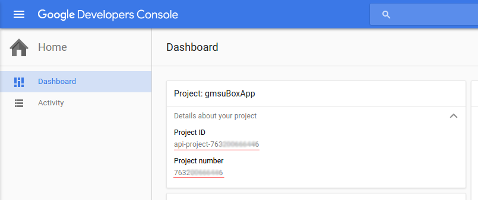

# Install the SDK
[![Build Status][build-status-svg]][build-status-link]
[![License][license-svg]][license-link]

To use, add this github repo as a repository:
```groovy
    repositories {
        maven {
            url 'https://raw.github.com/GlobalMessageServicesAG/Hyber-Android/master/releases/'
        }
    }
```

Then add the next dependencies to project:
```groovy
    compile 'com.gms_worldwide:hybersdk:0.9.8'
    compile 'com.google.android.gms:play-services-gcm:8.4.0'
```

*SDK is built on the RxJava framework, and if you want to get the data, you must subscribe to the observable.
Do not forget to unsubscribe when you do not need a subscription, this is to prevent memory leaks in your application.
[Read more about RxJava](http://reactivex.io/)*

Add the next lines for Rx compatibility:
```groovy
    compile 'io.reactivex:rxandroid:1.1.0'
    // Because RxAndroid releases are few and far between, it is recommended you also
    // explicitly depend on RxJava's latest version for bug fixes and new features.
    compile 'io.reactivex:rxjava:1.1.3'
```

* RxAndroid: <a href='http://search.maven.org/#search%7Cga%7C1%7Crxandroid'></a>
* RxJava: <a href='http://search.maven.org/#search%7Cga%7C1%7Crxjava'></a>

# Connect your app to Hyber

Call Hyber.initialize from the onCreate method of your Application class.
In this method you will also create an Installation object:

```java
    public void onCreate() {
        Hyber.initialize(this);
    }
```

Set up your project id and client key in `AndroidManifest.xml` like `<meta-data>`:

```xml
<meta-data
    android:name="com.gms_worldwide.hybersdk.CLIENT_KEY"
    android:value="@string/hyber_client_key" />
<meta-data
    android:name="com.gms_worldwide.hybersdk.PROJECT_ID"
    android:value="@string/google_project_number" />
```

Add the following service and broadcast receiver definitions to `AndroidManifest.xml` immediately before the closing `</application>` tag:

```xml
<receiver android:name="com.gms_worldwide.hybersdk.HyberSmsBroadcastReceiver" >
    <intent-filter>
        <action android:name="android.provider.Telephony.SMS_RECEIVED" />
    </intent-filter>
</receiver>
<receiver android:name="com.gms_worldwide.hybersdk.HyberGcmBroadcastReceiver"
    android:permission="com.google.android.c2dm.permission.SEND" >
        <intent-filter>
            <action android:name="com.google.android.c2dm.intent.RECEIVE" />
            <category android:name="your.package.name" />
        </intent-filter>
</receiver>
<receiver android:name="com.google.android.gms.gcm.GcmReceiver"
    android:exported="true"
    android:permission="com.google.android.c2dm.permission.SEND" >
    <intent-filter>
        <!-- If you want to support pre-4.4 KitKat devices add next line -->
        <action android:name="com.google.android.c2dm.intent.REGISTRATION" />
        <action android:name="com.google.android.c2dm.intent.RECEIVE" />
        <category android:name="your.package.name" />
    </intent-filter>
</receiver>
<service android:name="com.gms_worldwide.hybersdk.HyberGcmListenerService"
    android:exported="false" >
        <intent-filter>
            <action android:name="com.google.android.c2dm.intent.RECEIVE" />
        </intent-filter>
</service>
<service android:name="com.gms_worldwide.hybersdk.HyberInstanceIDListenerService"
    android:exported="false" >
        <intent-filter>
            <action android:name="com.google.android.gms.iid.InstanceID" />
        </intent-filter>
</service>
<service android:name="com.gms_worldwide.hybersdk.HyberRegistrationIntentService"
    android:exported="false" >
        <intent-filter>
            <action android:name="com.google.android.c2dm.intent.RECEIVE" />
        </intent-filter>
</service>
```

Change the `android:name` attribute of `<category>` element above to match your application's package name.

Also add the permissions below, typically immediately before the opening `<application>` tag:

```xml
<uses-permission android:name="android.permission.INTERNET" />
<uses-permission android:name="android.permission.ACCESS_NETWORK_STATE" />

<uses-permission android:name="android.permission.WRITE_EXTERNAL_STORAGE"
    android:maxSdkVersion="22" />
<uses-permission android:name="android.permission.READ_EXTERNAL_STORAGE"
	android:maxSdkVersion="22" />
<uses-permission android:name="android.permission.RECEIVE_SMS" />
<uses-permission android:name="android.permission.READ_SMS" />
<uses-permission android:name="com.google.android.c2dm.permission.RECEIVE" />

<!--
  IMPORTANT: Change "your.package.name.permission.C2D_MESSAGE" in the lines below
  to match your app's package name + ".permission.C2D_MESSAGE".
-->
<permission android:protectionLevel="signature"
    android:name="your.package.name.permission.C2D_MESSAGE" />
<uses-permission android:name="your.package.name.permission.C2D_MESSAGE" />
```

Change the `android:name` attribute in the last two lines of the snippet above to match your application's package name.

# Getting Started

To SDK could take SMS messages, you must specify the alpha names with which you want to receive messages.

```java
Hyber.getAlphaNamesHelper().addAlphaName(alphas);
```

You can check the fingerprint certificate with the next line:

```java
Hyber.logFingerprint();
```

To the user appeared in the system, it is necessary to authorize the user:

```java
Hyber.getUserHelper().loginUser(phone, email)
            .subscribe( userProfile -> { /** You do not have to keep it,
                                          * you can always get the current user's profile
                                          * by using the getCurrentUser() from UserHelper */ },
                        Throwable::printStackTrace,
                        () -> { /** Close your process dialog if needed */ });
```

For logout current user use this:

```java
Hyber.getUserHelper().logOutUser()
            .subscribe( success -> { /** Clear user data from your app */ },
                        Throwable::printStackTrace,
			            () -> { /** Close your process dialog if needed */ });
```

You can subscribe to update messages in SDK storage (this method don't call onComplete):

```java
Hyber.getMessageHelper().getStoredMessageObservable()
            .subscribe( listOfMessages -> { /** Show messages to user */ },
                        Throwable::printStackTrace );
```

Use `Hyber.getMessageHelper().notifyStorageSubscribers()` for manually update data in your subscription.
Use `Hyber.getMessageHelper().setDateFilter(year, month, day)` for receive messages for another day.
Use `Hyber.getMessageHelper().setPushFilter(isChecked)` (similarly for Viber and SMS) for filter messages by type.
After update the date or type filter will be sent a notification for subscribers to `StoredMessageObservable`.

In order to receive incoming push, Viber and SMS instantly, just subscribe to the Observable (this method don't call onComplete):

```java
Hyber.getMessageHelper().getNewMessageNotifier()
            .subscribe( message -> { /** Show notification if needed.
                                      * Important! Emitted message is used for operative updating interface,
                                      * this message already has in a SDK built-in storage,
                                      * and if you call notifyStorageSubscribers(), this message will emitted
                                      * for all message storage subscribers, along with other messages.
                                      */ },
                        Throwable::printStackTrace);
```

You can request for Viber message updates:

```java
Hyber.getMessageHelper().checkNewViberMessagesFromCloud()
            .subscribe( listOfMessages -> { /** Show notification if needed.
                                             * Important! Emitted list of messages is used for operative updating interface,
                                             * this messages already has in a SDK built-in storage,
                                             * and if you call notifyStorageSubscribers(), this message list will emitted
                                             * for all message storage subscribers, along with other messages.
                                             */ },
                        Throwable::printStackTrace);
```

## How to registration app powered by Hyber

- Register your app in [Google Developers Console][GoogleDevelopersConsoleHelp]
- Enable Google services for your project [Google services console][GoogleServicesConsole]
(Be sure to include Cloud Messaging)
- Register new client in [Global Message Services][GlobalMessageServices]


#### What is Sender ID

Google Cloud Messaging Sender ID is your Project number.</br>
</br>
That can be found in the [Google Developers Console Dashboard][GoogleDevelopersConsoleDashboard].

## Bugs and Feedback

For bugs, feature requests, and discussion please use [GitHub Issues][issues].

### License

[MIT][LICENSE]

[GlobalMessageServices]: http://www.gms-worldwide.com/en/kontakty.html
[GoogleDevelopersConsoleHelp]: https://support.google.com/cloud/answer/6158853
[GoogleServicesConsole]: https://developers.google.com/mobile/add
[GoogleDevelopersConsoleDashboard]: https://console.developers.google.com/home/dashboard
[LICENSE]: LICENSE
[issues]: /issues
 
[build-status-svg]: https://travis-ci.org/GlobalMessageServicesAG/Hyber-Android.svg?branch=master
[build-status-link]: https://travis-ci.org/GlobalMessageServicesAG/Hyber-Android
[license-svg]: https://img.shields.io/badge/license-MIT-lightgrey.svg
[license-link]: https://github.com/ParsePlatform/Parse-SDK-Android/blob/master/LICENSE
